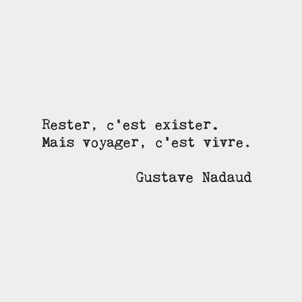
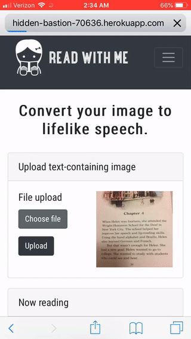
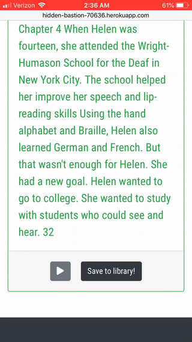

<p align="center"></p>

# Motivation
Imagine recovering from a stroke to discover that you are suddenly unable to read all but the simplest of words, or travelling to a foreign country and finding yourself overwhelmed by the seemingly indecipherable signs and menus. Or that due to worsening eyesight, it's becoming increasingly difficult to even see the words around you.

I wanted to develop an app that could be used by members of the low-vision community, children/adults encountering reading difficulties, or those travelling/living abroad. With this app, a user can take a picture of a sign, document, or any other text and the app will convert the textual content into clear and comprehensible speech. 

# Technology/Frameworks Used
## APIs
* Google Translate (docs [here](https://cloud.google.com/translate/docs/))
* Google Vision (docs [here](https://cloud.google.com/vision/docs/))
* Amazon Polly (docs [here](https://aws.amazon.com/polly/developers/#documentation))

## Templating Engine
* Handlebars

## Web App Framework
* Express

## Database
* MongoDB

## Front-end Framework
* Bootstrap

## Middleware
* Passport (for Google authentication)
* Multer (for uploading images)

# Usage
The app is mobile-responsive. To ensure that you get to test out all features (namely the image upload via camera feature), it is recommended that you use your mobile device to access the app, which is live and running [here](https://hidden-bastion-70636.herokuapp.com/).  

## On mobile (recommended)
Sign in using your Google account, then go to the picture page. Here, you can take a picture of text with your smartphone camera. (The text can be in any of the 19 supported languages included in the dropdown list.) Upon image submission, the app will return the text transcription and audio narration. From here, you can translate the text and audio into another language or save the image into your library. (If you didn't sign in and try to access either feature, you will get a message prompting you to first sign in.)

On the library page, you will see all the images you've saved. Clicking on an image will redirect you to the picture page and redisplay the image's text and audio. Clicking on the trash icon below an image will remove it from your library.

## On PC
Same as on mobile, but instead of being able to take a picture directly, you are able to upload an image from your local filesystem. Here are some sample images you can save and use when trying the app:


<br>



## Tips
The text detection is powered by the Google Vision API. For better results:
* Make sure the text you wish to capture is within 90 degrees of the horizontal axis of the picture.
* Multi-column layouts are not supported.
* Avoid highly stylized fonts.

Some things to note when using on mobile:
* On iOS devices, pictures taken in portrait orientation will display rotated clockwise 90 degrees on the library page. 
* Due to a bug inherent to the HTML5 audio element, the generated audio file will only play once, after which point the audio button becomes unresponsive. To play the audio again, you will need to refresh the page.

# Demo (on mobile)

## Part 1: Image capture


<br>

## Part 2: Upload image and view results


<br>

## Part 3: Language translation, save image to library


<br>

## Part 4: View saved image in library


<br>

## Part 5: Remove image from library



# Installation/Configuration
If you need to run the code on your local machine (e.g., to make contributions), begin by navigating to the root directory of the cloned project and installing dependencies:

```bash
npm i
```
This app uses environment variables. Below are the variables used in the env file. The format of each variable is given in brackets.

```
google_clientID=[url]
google_clientSecret=[string]
session_cookieKey=[string]

google_config=[json]
google_applicationCredentials=./read-with-me-auth-credentials.json

amazon_accessKeyId=[string]
amazon_region=[region]
amazon_secretAccessKey=[string]
```

In the snippet above, I have organized the env variables into three groups. The first group contains the variables needed for Google authentication. The second group is used to access the Google Vision (text detection) and Google Translate APIs. The third group is for accessing Amazon Polly. 

The first and second groups of keys can be obtained by [creating a new Google Cloud Platform (GCP) account](https://console.cloud.google.com/getting-started) and creating a new project. Once your project has been created, open the left sidebar menu and click on API & Services, and then Credentials. 

## Environment variables for Google authentication (OAuth)
Click on the blue Create credentials button and select OAuth client ID. Select web application and you will then be taken to a page with your client ID and secret. On the same page, you are prompted to enter a Javascript origin and a redirect URI. Set these to http://localhost:3000 and http://localhost:3000/auth/google/redirect, respectively, to complete the authentication setup. The remaining session_cookieKey variable in the env file can be set to whatever string you'd like. It is used to create the coookie which stores information about the authenticated user.

## Environment variables for access to Vision and Translate APIs
Return to the Credentials page and click on the Create credentials button again, this time selecting Service account key. Select JSON and click on Create, which will create the JSON file containing your credentials. You need to assign the contents of this file to the google_config variable in the env file, but you first have to format the JSON to remove the spaces. To do so, paste the one-liner 

```javascript 
console.log(JSON.stringify([JSON_KEY]));
```
into a new Javascript file (replacing [JSON_KEY] with your JSON), run the file in Node, and assign the output (which should be the same JSON without spaces) to google_config in your env file.

## Environment variables for access to Polly API
Start by [creating a new Amazon Web Services account](https://aws.amazon.com/console/). On the AWS Management Console page, search for IAM in the search bar and select. On the left sidebar, select Users and upon redirect, click the Add user button. For Select AWS access type on page 1, select Programmatic access and use default settings for the remaining pages. Once the user is created, select it and click the Security credentials tab on the Summary page. Click the Create access key button, and assign the resulting values to amazon_accessKeyId and amazon_secretAccessKey in your env file. The variable amazon_region can be found in your address bar and corresponds to the region you selected during account creation (e.g., "us-west-2").

You're almost there! Now that you have all your environment variables defined, run the following in your terminal:

```bash
npm run-script preinstall
```

This will create a new file containing your Google JSON credentials at the root directory so it can be accessed by the app.  

# Contributing
Pull requests are welcome.